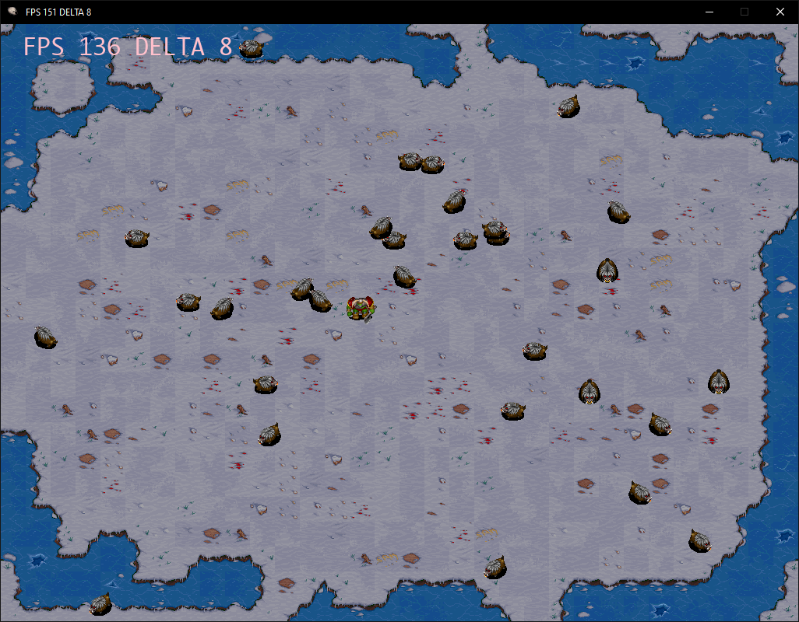

# Warcraft 2 Python

## Day 1

Here is what I managed to achieve on my hangover weekend:

1. Extracted all original sprites from Warcraft 2 with a little help of wargus tool.
2. Learned how to replace default unit colors into other color
3. Flipped some frames for left faced animations

These are common challenges when working with warcraft2 assets.


Lounch: ```py main.py```, use arrow keys to walk and spacebar to attack.

I'm looking forward to add terrain and some nice Map class if I ll ever have free time.

Game module contains for the moment:

Sprite class, to work with sprite frames without headache, Object class (I might rename it to Unit later) and Scene class to which units are added and which also runs a game.

And this is footman:

```python
class Footman(Object):
    def __init__(self):
        super().__init__()
        self.sprite = Sprite('./assets/sprites/footman.png',
                             width=72,
                             height=72,
                             vertical=True,
                             replace=((208, 212), (209, 213), (210, 214), (211, 215)),
                             speed=10)

        self.sprite.add('walk_up', cell=1, row=2, count=4)
        self.sprite.add('walk_down', cell=5, row=2, count=4)
        self.sprite.add('walk_right', cell=3, row=2, count=4)
        self.sprite.add('walk_left', cell=3, row=2, count=4, flip=(True, False))
        self.sprite.add('walk_rightup', cell=2, row=2, count=4)
        self.sprite.add('walk_rightdown', cell=4, row=2, count=4)
        self.sprite.add('walk_leftup', cell=2, row=2, count=4, flip=(True, False))
        self.sprite.add('walk_leftdown', cell=4, row=2, count=4, flip=(True, False))

        self.sprite.add('stand_up', cell=1, row=1, count=1)
        self.sprite.add('stand_down', cell=5, row=1, count=1)
        self.sprite.add('stand_right', cell=3, row=1, count=1)
        self.sprite.add('stand_left', cell=3, row=1, count=1, flip=(True, False))
        self.sprite.add('stand_rightup', cell=2, row=1, count=1)
        self.sprite.add('stand_rightdown', cell=4, row=1, count=1)
        self.sprite.add('stand_leftup', cell=2, row=1, count=1, flip=(True, False))
        self.sprite.add('stand_leftdown', cell=4, row=1, count=1, flip=(True, False))

        self.sprite.add('attack_up', cell=1, row=6, count=4)
        self.sprite.add('attack_down', cell=5, row=6, count=4)
        self.sprite.add('attack_right', cell=3, row=6, count=4)
        self.sprite.add('attack_left', cell=3, row=6, count=4, flip=(True, False))
        self.sprite.add('attack_rightup', cell=2, row=6, count=4)
        self.sprite.add('attack_rightdown', cell=4, row=6, count=4)
        self.sprite.add('attack_leftup', cell=2, row=6, count=4, flip=(True, False))
        self.sprite.add('attack_leftdown', cell=4, row=6, count=4, flip=(True, False))

        self.anim = 'stand_down'

        self.x = 0
        self.y = 0
        self.width = 180
        self.height = 180

        self.vertical = 'down'
        self.horizontal = ''
        self.speed = 5

        self.mode = 'stand'

    def update(self, delta):
        self.next(delta)

        x = 0
        y = 0

        if self.key(pygame.K_UP):
            y = -1
            self.vertical = 'up'
        elif self.key(pygame.K_DOWN):
            y = 1
            self.vertical = 'down'
        elif self.key(pygame.K_RIGHT) or self.key(pygame.K_LEFT):
            self.vertical = ''

        if self.key(pygame.K_LEFT):
            x = -1
            self.horizontal = 'left'

        elif self.key(pygame.K_RIGHT):
            x = 1
            self.horizontal = 'right'
        elif self.key(pygame.K_UP) or self.key(pygame.K_DOWN):
            self.horizontal = ''

        if self.vertical == '' and self.horizontal == '':
            self.vertical = 'down'

        if self.key(pygame.K_SPACE):
            self.mode = 'attack'
        elif x != 0 or y != 0:
            self.mode = 'walk'
        else:
            self.mode = 'stand'

        if self.mode == 'walk':
            self.play('walk_'+self.horizontal+self.vertical)
            self.move(x*delta/self.speed, y*delta/self.speed)
        elif self.mode == 'attack':
            self.play('attack_'+self.horizontal+self.vertical)
        else:
            self.play('stand_'+self.horizontal+self.vertical)
```

## Day 2

On day 2 I made Action class it is like a task for a unit which changes unit properties in time or by speed, than I made little hogs which are known as critters in Warcraft and assigned random movement Actions. FPS dropped to 200 while having 1000 hogs on screen. I was almost happy because I had Sprite, Unit and Actions it was time for a Map.

## Day 3

Map is not easy because first I needed a toool in which I can create a map and than import into game. After a little research it seems Tiled Map Editor returns a file in which in an one dimensional array I get map data, in which every element is a tile number in tileset. Of course that was enough and I tested displaying fixed size map. But I messed a little with creating tilesets in Editor and also map rendering dropped fps again:

 
